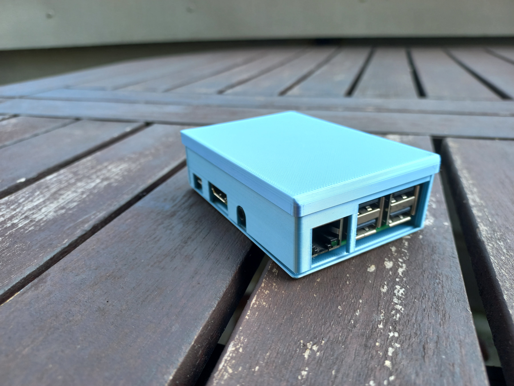
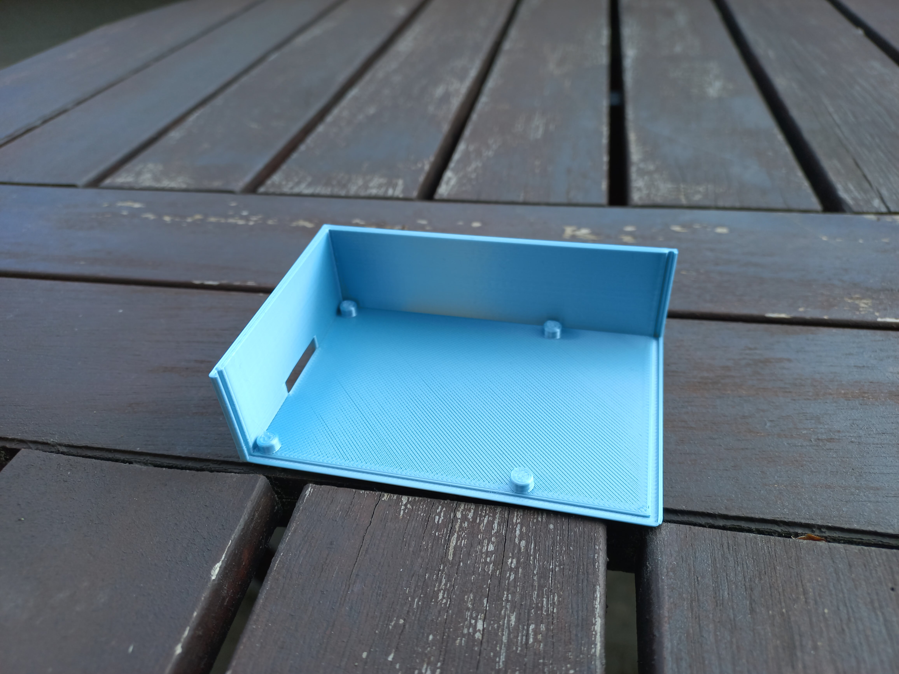
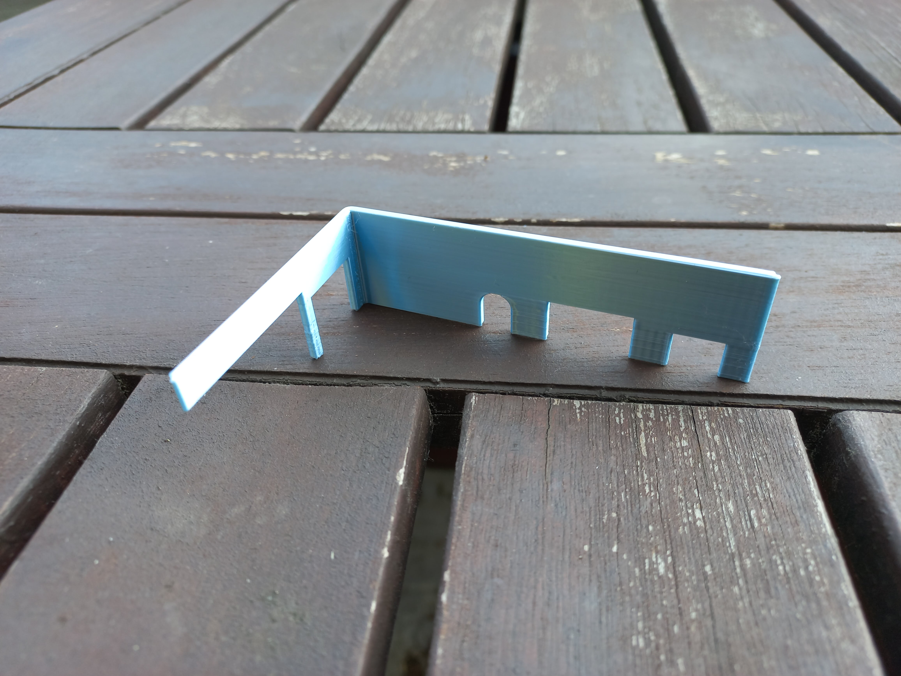
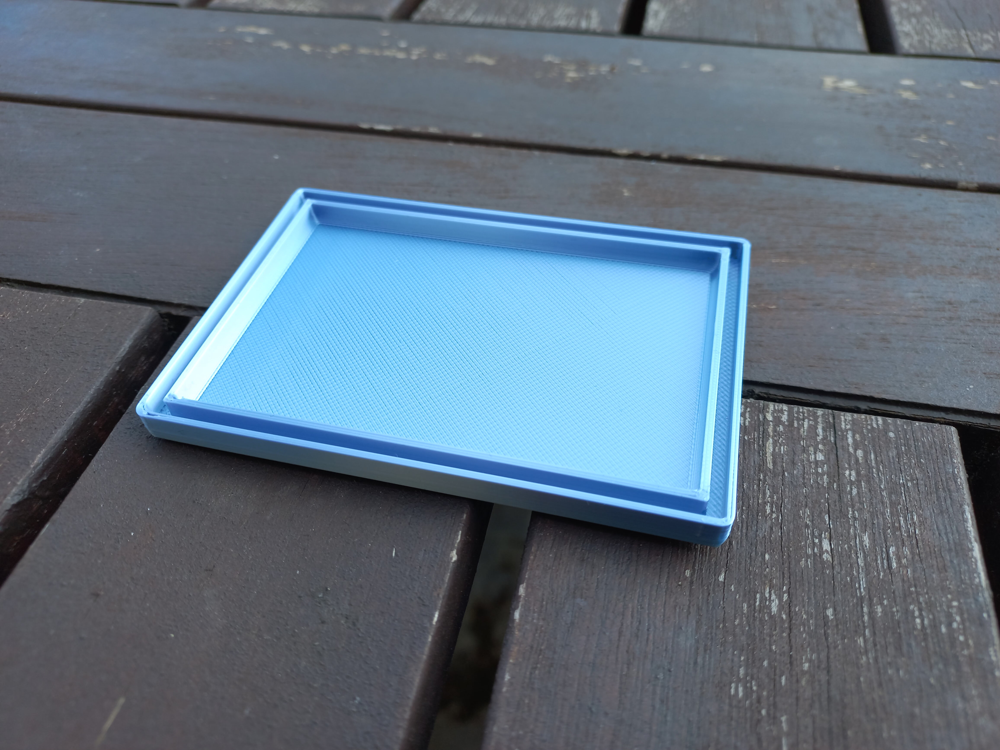
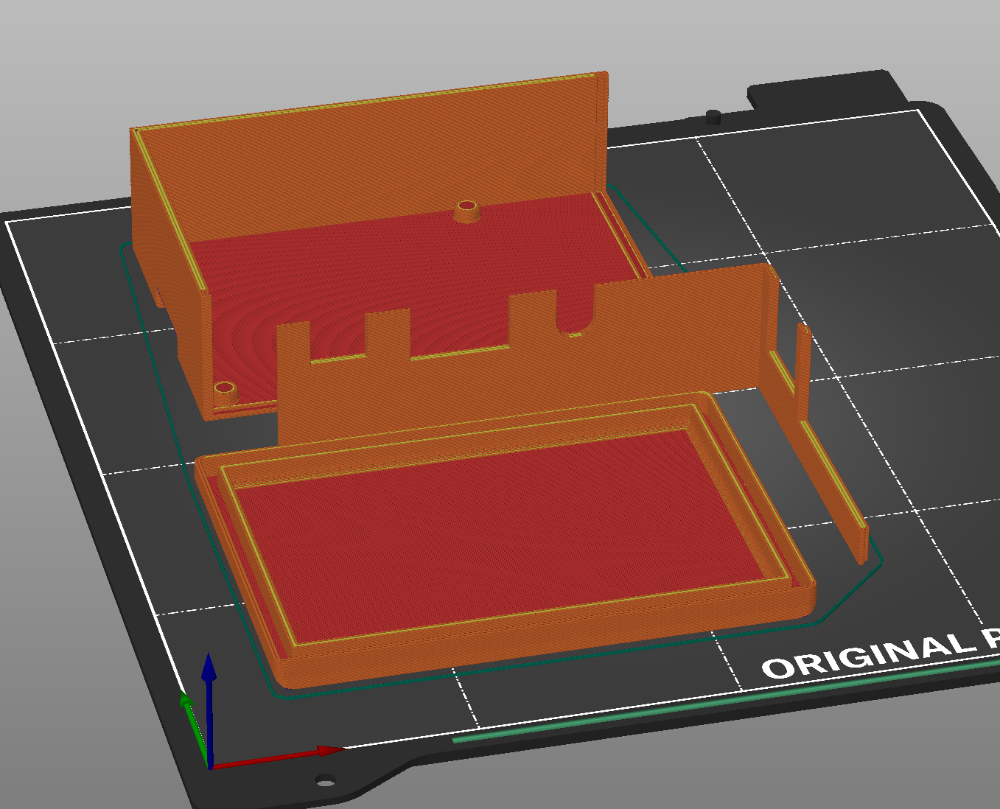
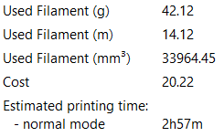
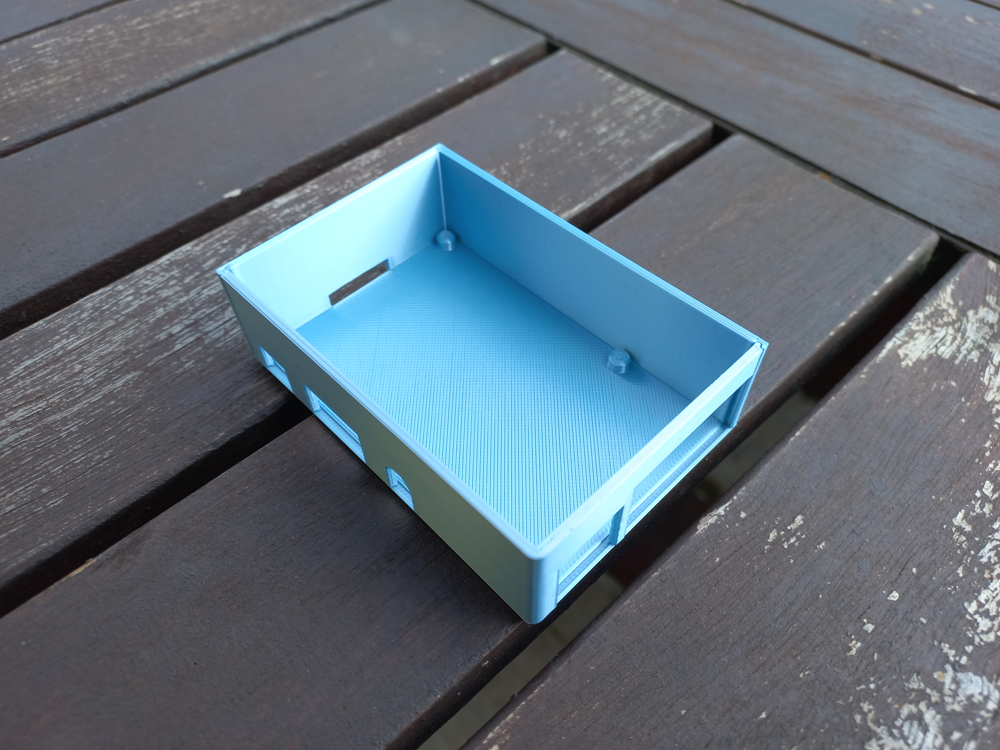
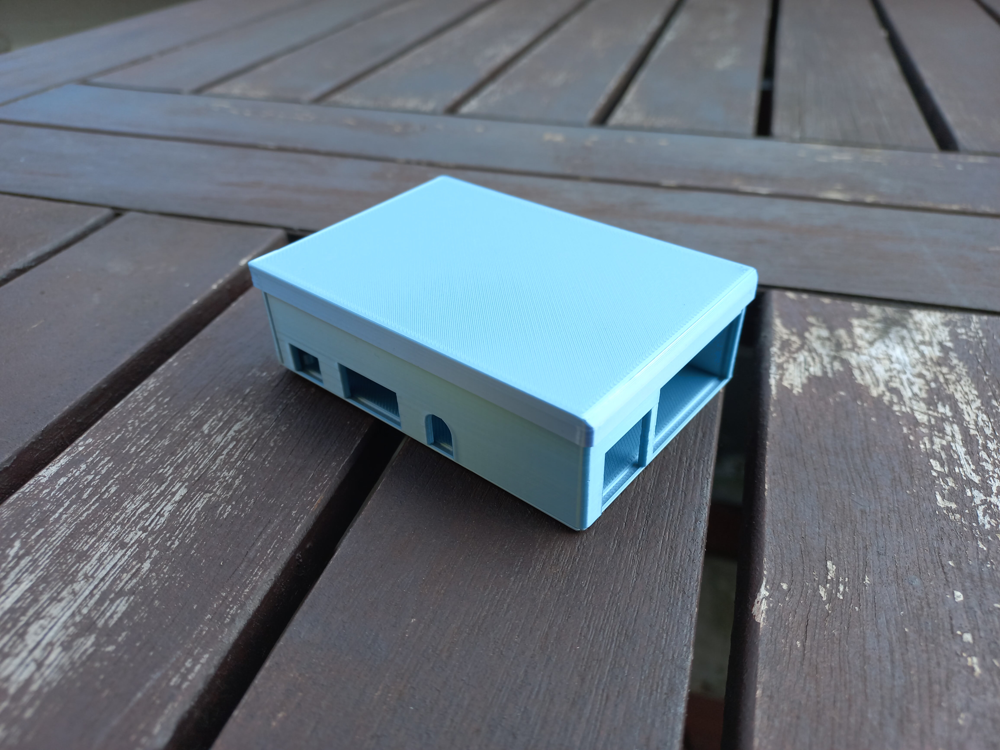

<!--  -->
# Krabička na Raspberry pi
 

[Thingiverse](https://www.thingiverse.com/)
## Díly
 - Základ 
 - Stěna 
 - Kryt 

## Instrukce na sestavení
### 1. Vytiskněte model
 
 
 [Modely na vytisknutí](./print)

 doporučený materiál: PLA
  
 doporučené nastavení: 0.2 mm QUALITY
 
 Info o tisku:
 

### 2. Sestavte z dílů

