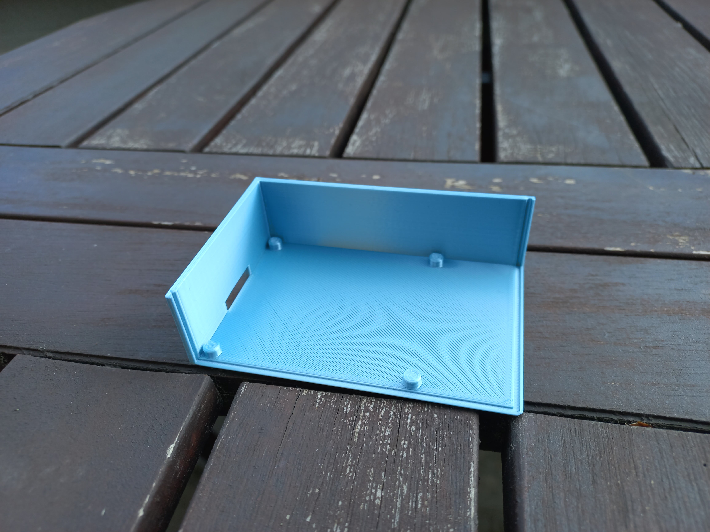
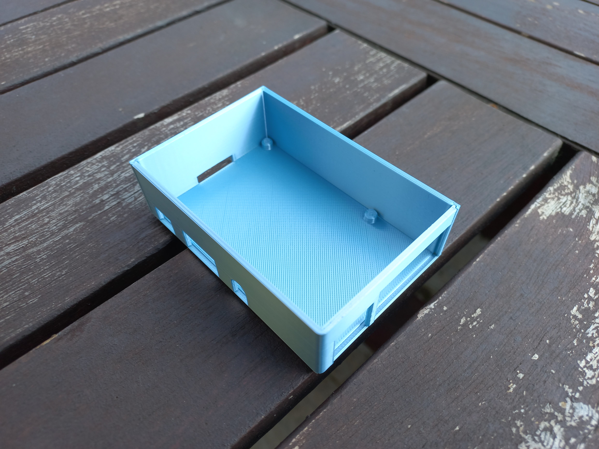

<!--  -->
# Case for a Raspberry Pi
 

[Thingiverse](https://www.thingiverse.com/)
## Supported models
- Raspberry Pi 2 B
- Raspberry Pi 3 B
- Raspberry Pi 3 B+

## Parts
 - Base 
 - Side 
 - Cover 

## Instructions for assembly
### 1. Print out the model
 
 
 [Models to print](./print)
 
 Recommended material: PLA
 
 Recommended setting: 0.2 mm QUALITY

 Print info:
 

### 2. Assemble from parts

